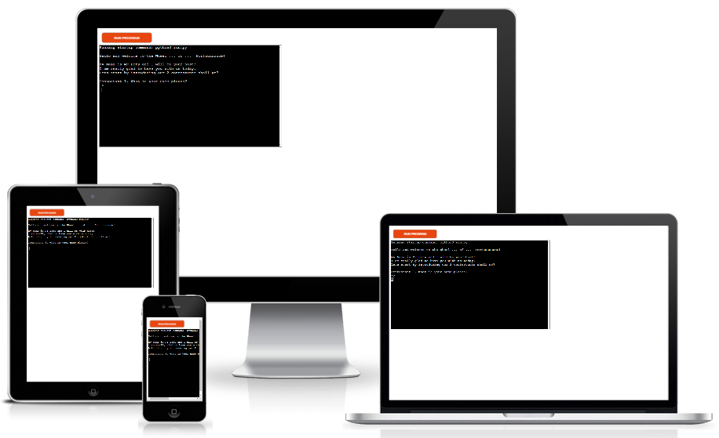

# Whee-Of-Fortune

[Click here to access live project](https://the-wheel-of-fortune.herokuapp.com/)
## Table of contents
1. [Introduction](#Introduction)
2. [UX](#UX)
    1. [Ideal User Demographic](#Ideal-User-Demographic)
    2. [User Stories](#User-Stories)
    3. [Development Planes](#Development-Planes)
    4. [Design](#Design)
3. [Features](#Features)
    1. [Design Features](#Design-Features) 
    2. [Existing Features](#Existing-Features)
    3. [Features to Implement in the future](#Features-to-Implement-in-the-future)
4. [Issues and Bugs](#Issues-and-Bugs)
5. [Technologies Used](#Technologies-Used)
     1. [Main Languages Used](#Main-Languages-Used)
     3. [Frameworks, Libraries & Programs Used](#Frameworks,-Libraries-&-Programs-Used)
6. [Testing](#Testing)
     1. [Testing.md](TESTING.md)
7. [Deployment](#Deployment)
     1. [Deploying on GitHub Pages](#Deploying-on-GitHub-Pages)
8. [Credits](#Credits)
     1. [Media](#Media)
     2. [Code](#Code)
9. [Acknowledgements](#Acknowledgements)
***

## Introduction

[Back to top ⇧](#Wheel-Of-Fortune)

## UX
### Ideal User Demographic

### User-Stories
#### Frequent User Goals

#### New User Goals

[Back to top ⇧](#Wheel-Of-Fortune)

### Development-Planes

#### Strategy
The game will focus on the following target audience
* Audience
    * 
    
* Demographic
    *
    
* Psycho Characteristics
    * 

The Users must find these informations:
    * 
    
The Administrator has to receive thiese information:
    * The name of the players
    * The number of rounds to be played
    
#### Scope

Now that we have established the goals of the game we can deduce the necessary features:
* Required functionality
    * 

[Back to top ⇧](#Wheel-Of-Fortune)

### Design

[Back to top ⇧](#Wheel-Of-Fortune)

## Features
### Existing Features
- **Player names** - 

[Back to top ⇧](#Wheel-Of-Fortune)

### Features to Implement in the future
* More players
     Only 2 players can play now but the real show has 3. a feature to ask how many people can play would be fun.
* Special price and special wheel value
     Special prize such as trips or cars at certain rounds just like in the real game. 

[Back to top ⇧](#Wheel-Of-Fortune)

## Issues and Bugs 
Several issues were encountered during developpement but the most troublesome are listed below.

* Checkboxes in Form

[Back to top ⇧](#Wheel-Of-Fortune)

## Technologies Used
### Main Languages Used
* Python3
### Frameworks, Libraries & Programs Used
- [Heroku](https://heroku.com/ "Link to Heroku") was used to deploy the game.
- [GitPod](https://gitpod.io/ "Link to GitPod homepage") was used for writing, commiting, and pushing code.
- [GitHub](https://github.com/ "Link to GitHub")
- [Am I Responsive?](http://ami.responsivedesign.is/# "Link to Am I Responsive Homepage") was used to verify responsiveness and to create the top picture of this README.md

[Back to top ⇧](#Wheel-Of-Fortune)

## Testing
Refer to this [page](TESTING.md) please

## Deployment
The site was developped on Gitpod, commiting and pushing to github.

### Deploying on Heroku

    
[Back to top ⇧](#Wheel-Of-Fortune)

## Credits 
### Code 
The developer has consulted countless times Stack Overflow and W3Schools in ordeer to build the game.
[Back to top ⇧](#Wheel-Of-Fortune)

## Acknowledgements
I would like to thank:
* My wife  for her patience and her kind words when I was in doubt.
* my mentor, Seun, for her counseling and her contagious enthusiasm and love for coding.
* my fellow coding students of Code institue who have been invaluable on Slack.

[Back to top ⇧](#Wheel-Of-Fortune)

***