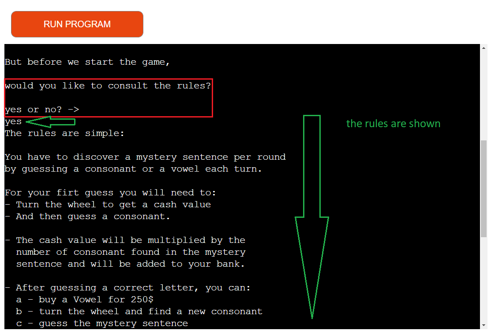
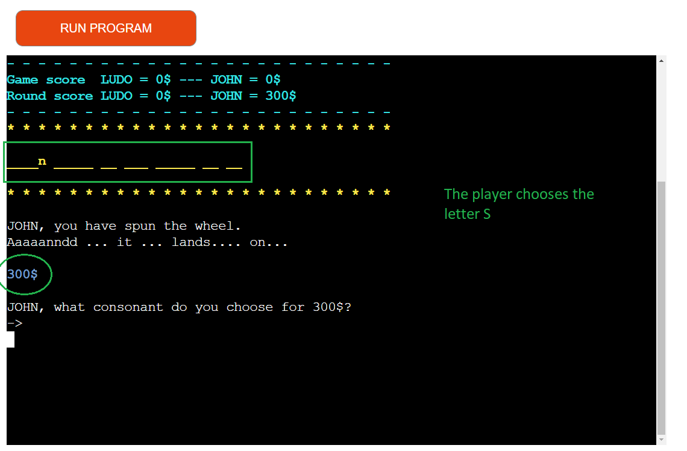

# Wheel-Of-Fortune - Testing 

[Main README.md file](/README.md)

[View live project](https://the-wheel-of-fortune.herokuapp.com/)

***
## Table of contents
1. [Testing User Stories](#Testing-User-Stories)
2. [Manual Testing](#Manual-Testing)
3. [Automated Testing](#Automated-Testing) 
     - [Code Validation](#Code-Validation)
4. [User Testing](#User-Testing)

***

## Testing User Stories
#### Frequent User Goals:
* As a frequent user, I want a game that resembles the original wheel of fortune game play.
     * The game rules are identical to the original TV show
     * A host presents the game (Mr Boty).
     * Players turn a wheel

* * As a frequent user, I want a challenging game.
     * The game can become sometimes difficult, especially with samll sentences
     * The randomness of the wheel can sometimes flip the situation and make a winner a loser.
     
* As a frequent user, I want to have new experiences and discover new things when playing.
     * There are morethan 800 sentences to play with. 
     * Mr Boty has different interactions with the players according to the situation.

#### New User Goals:
* As a new user, I want the commands to be clear.
     * Each necessary action for the player is clearly described by the system. If and entry is wrong, the game tells it. 
     * The players always see the most important features.

* As a new user, I want to understand the rules.
     * The rules are simply explained and are skippable. 

* As a new user, I want a fun experience.
     * The game is quite challenging at times and unpredictable. 
     * 2 players compete.

[Back to top](#Wheel-Of-Fortune---Testing)
## Manual Testing
### Phase 1 The pre game
* Inserting players name

      

* Asking for the number of round

     

* Asking for the rules

     
     

### Phase 2 The game
* Creating and displaying the Mystery Sentence

     

* Turning the wheel

     

* Cash value

     

* Passing turn

* Bankrupt

      

* Inserting a consonant

      

* Verify the consonant

* Consonant already guessed

* Print consonant

      

* Calculate turn earning

      
     

* 3 choices after correct guess

      

* buy a vowel

     

* Not enough money to buy Vowel

     

* guess sentence

     

* Winning round

* Calculate round money

* Last round

* Winning Game

      
## Automated Testing
### Code Validation
* PEP8 CI Python Linter 

[Back to top](#Wheel-Of-Fortune---Testing)

## User testing 
Special thanks to the following who tested and gave me their feedback and ideas to improve the game:
* My wife Domnika 
* My Mentor Koko The champion of the wheel of fortune. Really lads she is unbeatable.....

***
